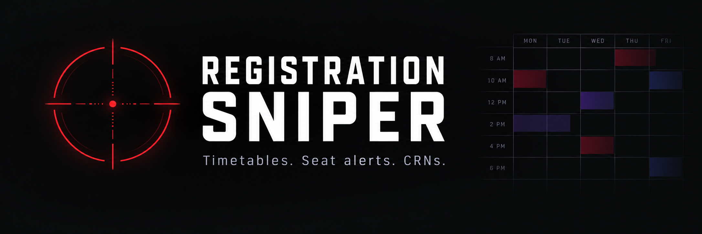
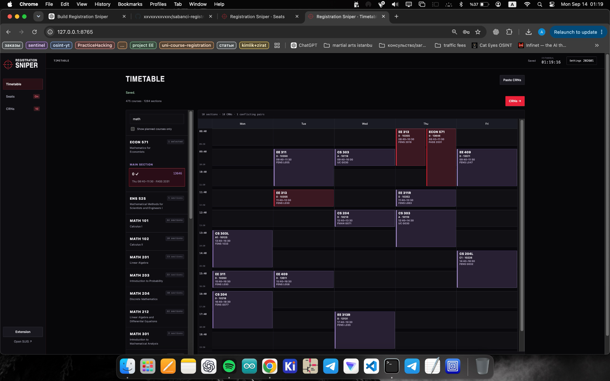

<p align="center">
  
</p>

<p align="center">
  <strong>A focused registration workspace for Sabancı students.</strong><br>
  Build a timetable. Watch sections. Keep every CRN ready.
</p>

<p align="center">
  <a href="#preview">Preview</a> ·
  <a href="#features">Features</a> ·
  <a href="docs/DEPLOYMENT.md">Deploy</a> ·
  <a href="docs/LOCAL-APP.md">Local app</a> ·
  <a href="PRIVACY.md">Privacy</a>
</p>

---

## Preview



*Actual desktop screenshot from an earlier build. The current timetable adds distinct course colors and yellow warning triangles on overlapping meetings.*

## Features

| Timetable | Seat alerts | CRNs |
| :--- | :--- | :--- |
| Search courses and sections | Watch selected sections and backups | Import a complete CRN list |
| Choose each component independently | View public seat counts and timestamps | Check duplicates and time conflicts |
| Group courses by color | Sound, desktop and optional Telegram alerts | Prepare and copy selected CRNs |
| Split overlapping meetings into lanes | Review alternatives that fit the schedule | Save plans and export backups |

Lecture, lab, recitation and discussion sections each have their own CRN. Instructor names are not used to infer which combinations the university accepts.

## Open in a browser

The `web/` application is prepared for **Cloudflare Workers + D1**, with source code stored on GitHub. Visitors use the website without installing Python or an extension.

[](https://deploy.workers.cloudflare.com/?url=https://github.com/xxvxxvxxvxxv/sabanci-registration-sniper/tree/main/web)

**Repository owner:** upload this package before using the deployment button. Cloudflare deployment is not yet verified. Follow the [deployment guide](docs/DEPLOYMENT.md); Cloudflare will assign a `workers.dev` address, or a custom domain can be attached. No ChatGPT hosting dependency is included in this package.

To transfer a local plan: **local app → Settings → Export plan**, then **website → Settings → Import plan**. Telegram pairing is configured separately.

## Current status

| Component | Status |
| :--- | :--- |
| Local Python planner and public seat monitor | Available |
| Browser planner and shared seat backend | Packaged for Cloudflare; production verification pending |
| Persistent Chrome side panel | Available in the local extension |
| CRN autofill | Tested on the bundled local mock form |
| Autofill on the actual SUIS registration form | Pending implementation and verification |
| Automatic enrollment / login | Not implemented |

An available seat is an observation, not a reservation. Eligibility, required components and final registration status are determined by SUIS.

## Privacy by design

- **Personal plans:** stored on the user's computer or in their browser, depending on the version.
- **Public seat feed:** receives requested terms and CRNs; caches public observations for reuse.
- **Telegram:** optional personal bot. In the web version, the browser connects directly to Telegram; the server never receives the bot token.
- **SUIS credentials:** never requested by the app.

Browser monitoring and alerts require an open tab and an awake device. In the local version, Python must stay running. Export a backup before clearing browser data. See [privacy and data destinations](PRIVACY.md).

<details>
<summary><strong>Run the local Python version</strong></summary>

Python 3.9+ is required. No Python packages need to be installed.

```bash
python3 app.py
```

Open `http://127.0.0.1:8765` and keep the Terminal window open. Windows users can use `py app.py`.

For the extension, open `chrome://extensions`, enable Developer mode, and load the `extension/` folder. The toolbar icon opens a persistent side panel. Connect it through the local app's **Extension** dialog.

See [local setup and upgrade notes](docs/LOCAL-APP.md).

</details>

<details>
<summary><strong>Development and verification</strong></summary>

```bash
python3 -m unittest discover -v
node --test extension/test-autofill.cjs
```

The Python and extension suites cover planning, persistence, parsing, monitor transitions and mock-form guards. Web checks cover local plan storage, CRN imports, conflicts, request boundaries and shared queue behavior. Mock tests do not establish real SUIS autofill support.

The web deployment uses `web/src/worker.ts`, `web/public/` and D1 migrations in `web/migrations/`. The [web README](web/README.md) documents development and deployment.

</details>

## Sources and credits

Course catalog: [Sutable](https://sutable.vercel.app/202601). Registration and public seat details: [Sabancı SUIS](https://suis.sabanciuniv.edu/). Registration guidance: [official hub](https://bannerweb.sabanciuniv.edu/).

The bundled Fall 2026–27 catalog is a dated snapshot. The Spring 2026 PDF included in Settings is historical and does not define Fall registration windows.

Typography: Nimbus Sans Narrow Bold — [font license](assets/FONT-LICENSE.txt). Banner: original generated project artwork. Screenshot: actual desktop app capture.

**Independent student project. Not affiliated with or endorsed by Sabancı University.**
